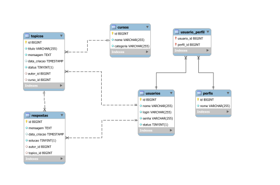
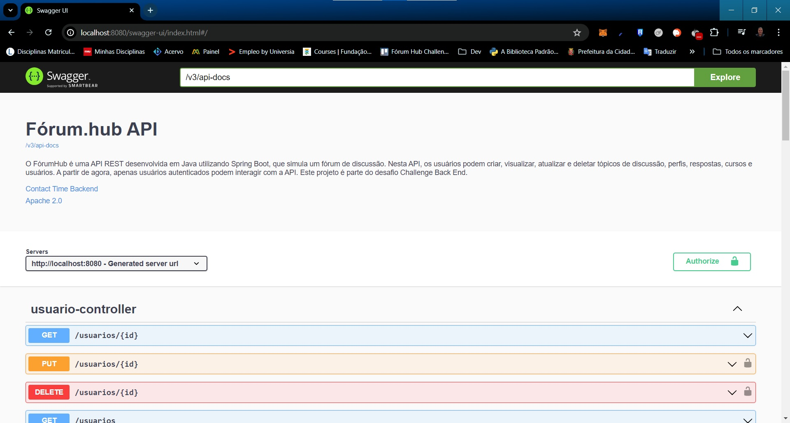

# FórumHub API

## Descrição

<p align="justify">
O FórumHub é uma API REST desenvolvida em Java utilizando Spring Boot, 
que simula um fórum de discussão. Nesta API, os usuários podem criar, 
visualizar, atualizar e deletar tópicos de discussão, perfis, respostas, 
cursos e usuários. A partir de agora, apenas usuários autenticados podem 
interagir com a API. Este projeto é parte do desafio Challenge Back End.
</p>

## Funcionalidades

A API FórumHub permite as seguintes operações:

- **CRUD de Tópicos:** Permite aos usuários autenticados criar, visualizar, atualizar e deletar tópicos de discussão.
- **CRUD de Perfis:** Permite aos usuários autenticados criar, visualizar, atualizar e deletar perfis.
- **CRUD de Respostas:** Permite aos usuários autenticados criar, visualizar, atualizar e deletar respostas em tópicos.
- **CRUD de Cursos:** Permite aos usuários autenticados criar, visualizar, atualizar e deletar cursos.
- **CRUD de Usuários:** Permite aos administradores criar, visualizar, atualizar e deletar usuários.

## Tecnologias Utilizadas

- **Java:** Linguagem de programação usada para desenvolver a API.
- **Spring Boot:** Framework utilizado para construir a API REST.
- **Spring Security:** Módulo de segurança do Spring utilizado para autenticação e controle de acesso.
- **JWT (JSON Web Token):** Utilizado para autenticação stateless e segura.
- **auth0:** Serviço de gestão de identidade e autenticação usada para integrar e gerenciar as credenciais dos usuários.
- **Spring Doc:** Utilizado para geração automática de documentação da API.
- **MySQL:** Banco de dados relacional para armazenamento dos dados.

## Diagrama do Banco de Dados



## Pré-requisitos

Para executar o projeto, você precisará ter instalado:

- **Java 11** ou superior
- **Maven**
- **MySQL** (instalado e configurado)

## Como Configurar e Executar

### Configurar Banco de Dados MySQL

1. Crie um banco de dados no MySQL:
   ```sql
   CREATE DATABASE forumhub;
   ```

2. Configure o usuário e as permissões do banco de dados (substitua `your-username` e `your-password` pelos valores
   apropriados):
   ```sql
   CREATE USER 'your-username'@'localhost' IDENTIFIED BY 'your-password';
   GRANT ALL PRIVILEGES ON forumhub.* TO 'your-username'@'localhost';
   FLUSH PRIVILEGES;
   ```

### Configurar Aplicação

1. Clone o repositório para sua máquina local:
   ```bash
   git clone https://github.com/dcmacedo/forumhub_api.git
   cd forumhub_api
   ```

2. Configure as credenciais do banco de dados no arquivo `src/main/resources/application.properties`:
   ```properties
   spring.datasource.url=jdbc:mysql://localhost:3306/forumhub
   spring.datasource.username=your-username
   spring.datasource.password=your-password
   spring.datasource.driver-class-name=com.mysql.cj.jdbc.Driver

   spring.jpa.hibernate.ddl-auto=update
   spring.jpa.show-sql=true
   
   server.error.include-stacktrace=never

   api.security.token.secret=${JWT_SECRET}
   ```

3. Compile e execute a aplicação usando Maven:
   ```bash
   mvn spring-boot:run
   ```

4. Acesse a aplicação em `http://localhost:8080`.

5. A documentação da API gerada pelo Spring Doc pode ser acessada em `http://localhost:8080/swagger-ui.html`.



## Endpoints da API(amostra)

### Criar um novo tópico

- **Endpoint:** `POST /topicos`
- **Descrição:** Cria um novo tópico.
- **Request Body:**
  ```json
  {
    "titulo": "Título do Tópico",
    "mensagem": "Conteúdo do Tópico",
    "curso": "Curso"
  }
  ```
- **Response:**
  ```json
  {
    "id": 1,
    "titulo": "Título do Tópico",
    "mensagem": "Conteúdo do Tópico",
    "data_criacao": "2024-06-18T12:00:00",
    "status": true,
    "autor": "Autor do Tópico",
    "curso": "Curso do Tópico"
  }
  ```

### Mostrar todos os tópicos criados

- **Endpoint:** `GET /topicos`
- **Descrição:** Retorna todos os tópicos.
- **Response:**
  ```json
  {
    "totalPages": 1,
    "totalElements": 2,
    "size": 10,
    "content": [
        {
            "id": 3,
            "titulo": "Alteração de Mais uma dúvida no Spring Boot",
            "mensagem": "Não tenho dificuldades em iniciar um projeto",
            "data_criacao": "2024-06-17T18:25:20",
            "status": true,
            "autor": "Nome do autor",
            "curso": "Java"
        },
        {
            "id": 4,
            "titulo": "Mais uma dúvida no Spring Boot",
            "mensagem": "Tenho dificuldades em iniciar um projeto",
            "data_criacao": "2024-06-18T11:15:53",
            "status": true,
            "autor": "Nome do autor",
            "curso": "Spring Boot"
        }
    ],
    "number": 0,
    "sort": {
        "empty": true,
        "sorted": false,
        "unsorted": true
    },
    "first": true,
    "last": true,
    "numberOfElements": 2,
    "pageable": {
        "pageNumber": 0,
        "pageSize": 10,
        "sort": {
            "empty": true,
            "sorted": false,
            "unsorted": true
        },
        "offset": 0,
        "paged": true,
        "unpaged": false
    },
    "empty": false
  }
  ```

### Mostrar um tópico específico

- **Endpoint:** `GET /topicos/{id}`
- **Descrição:** Retorna um tópico pelo ID.
- **Response:**
  ```json
  {
    "id": 4,
    "titulo": "Mais uma dúvida no Spring Boot",
    "mensagem": "Tenho dificuldades em iniciar um projeto",
    "data_criacao": "2024-06-18T11:15:53",
    "status": true,
    "autor": "Nome do autor",
    "curso": "Spring Boot"
  }
  ```

### Atualizar um tópico

- **Endpoint:** `PUT /topicos/{id}`
- **Descrição:** Atualiza um tópico pelo ID.
- **Request Body:**
  ```json
  {
    "titulo": "Alteração de Mais uma dúvida no Spring Boot",
    "mensagem": "Não tenho dificuldades em iniciar um projeto",
    "autor": "Nome do autor",
    "curso": "Java e Spring Boot"
  }
  ```
- **Response:**
  ```json
  {
     "id": 4,
    "titulo": "Alteração de Mais uma dúvida no Spring Boot",
    "mensagem": "Não tenho dificuldades em iniciar um projeto",
    "data_criacao": "2024-06-18T11:15:53",
    "status": true,
    "autor": "Nome do autor",
    "curso": "Java e Spring Boot"
  }
  ```

### Eliminar um tópico

- **Endpoint:** `DELETE /topicos/{id}`
- **Descrição:** Deleta um tópico pelo ID.
- **Response:** `204 No Content`

## Documentação da API
A documentação da API gerada pelo Spring Doc pode ser acessada em `http://localhost:8080/swagger-ui.html`.

## Estrutura do Projeto

O projeto segue a estrutura padrão do Spring Boot:

```
src/
├── main/
│   ├── java/
│   │   └── hub/
│   │       └── forum/
│   │           └── api/
│   │               ├── controller/
│   │               ├── domain/
│   │               ├── infra
│   │               └── ApiApplication.java
│   └── resources/
│       ├── application.properties
│       └── db.migration
└── test/
    └── java/
        └── hub/
            └── forum/
                └── api/            
```

## Contato

Para mais informações, entre em contato pelo e-mail: [dcotrimmacedo@gmail.com](mailto:dcotrimmacedo@gmail.com)
